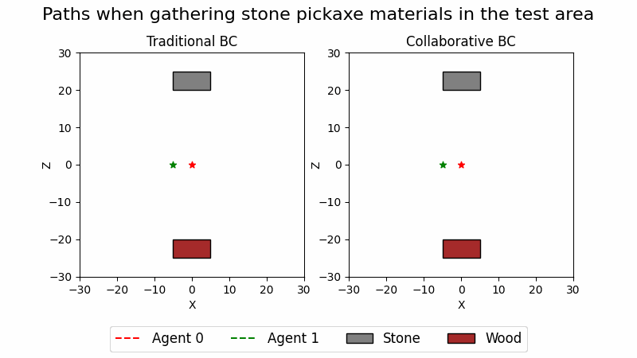

#  Using Backward Chained Behavior Trees to Control Cooperative Minecraft Agents

This project contains the code that was used in the report **"Using Backward Chained Behavior Trees to Control Cooperative Minecraft Agents" by Justin Salér.** 

> This report presents a strategy to control multiple collaborative intelligent agents acting in a complex, versatile
> environment. The proposed method utilizes back-chained behavior trees and 1-to-1 task distribution. The agents claim a
> task, which prevents other agents in the system to start working on the same task. Backward chaining is an algorithm for
> generating reactive agents from a set of goals. The method was evaluated in Minecraft with Microsoft’s Project Malmo
> API. Two different scenarios were considered. In the first one, a group of agents collaborated to build a structure. In
> the second one, a group of agents collaborated while gathering material. We propose and evaluate three algorithms with
> different levels of agent-cooperation and complexity (Algorithm 1, Algorithm 2, and Algorithm 3). The evaluation shows
> that backward chained Behaviour Trees (BTs) works well for multiagent coordination in complex versatile environments and
> that adding 1-to-1 task distribution increases the efficiency of the agents when completing the experiment task.

*- Abstract from the report*

# Results

## Animations

These animations show comparisons between Algorithm 1 and Algorithm 3.

### Placing fence posts in a flat world with trees


### Gathering stone and wood in a test arena



# HOWTO

## How to setup

You can just run the following command to install the Python libraries required for the examples in this project:

```
pip install -r requirements.txt
```

NB! This has been tested on Python 3.6 and Project Malmo 0.36.0

## How to run
To run the experiment, you need to 
1. Open the necessary Minecraft clients with the Project Malmo plugin. For example, if you want to run the experiments using three cooperative agents, open three Minecraft clients.
2. Run the experiments. Either by using the UI or without the UI. 
  
Before running the experiments, you need to open the number of Minecraft clients you want to use. The Minecraft clients should use the ports 1000-1000+N-1, where N is the number of agents you are testing. To ease opening the Minecraft clients, one can use the script `malmoutils/minecraft.py`.

There are two primary ways to run the experiments. 
1. With UI. Use `main.py` to open the UI to run the experiments.
2. Using `experiment/test.py`. This code was used to generate most of the data in the report.


# Questions or comments
If you have any questions, either consult [the report](/report.pdf) or reach out to me at justin@saler.nu . 
